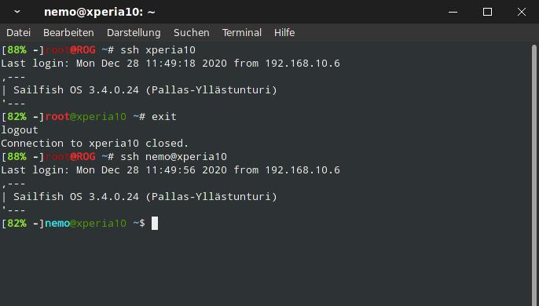

# bash customization

I got some linux devices like Notebooks, RPi's and SailfishOS Smartphones.
It's anoying working remotly via ssh on this devices when powered by battery, not knowing the battery status.
So i added this cool function to the bash command prompt.
Additionally i added different colors for the prompt for each device and user. 

Add this at the beginning of your .bashrc file or /etc/bashrc for global use.
I found the battery code on a pine64 forum but it had some issues. I fixed it for my best use case.

Btw. since Sailfish OS 4.x update replaces /bin/bash with a symlink to /usr/bin/busybox, 
you have to install gnu-bash to use .bashrc.

 

